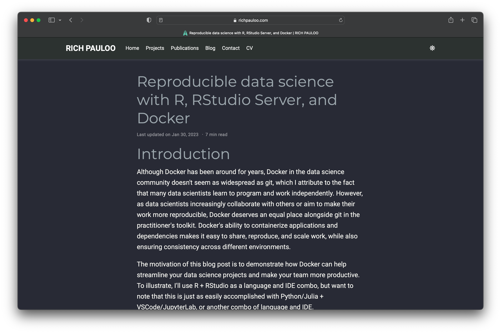

# Welcome

This project explores using [Docker](https://www.docker.com) to explore developing applications with the [R](https://www.r-project.org) and [Python](https://www.python.org) programming languages as quickly as possible using [Posit RStudio IDE](https://posit.co/products/open-source/rstudio/) or [VS Code](https://code.visualstudio.com).

## Background

The primary goal of this project was to create a containerized environment to explore [Posit RStudio IDE](https://posit.co/products/open-source/rstudio/) that would work on Apple Silicon. My original journey began exploring images from the highly regarded [Rocker Project](https://rocker-project.org) - known for various Docker Containers for the [R](https://www.r-project.org) environment.

As long as you run on architecture other than Apple Silicon, you'll find that the latest versions and tags will work fine. If you're on Apple Silicon, though...good fucking luck.

It took me hours of experimenting. Hours of banging my head against the wall. Reviewing horribly outdated "solutions" from the internet at large. I damn near reached the point of frustration - half considering biting the bullet and embarking down the path of building on top of a base Linux image and suffering through countless command-line incantations until the damn thing worked.

Despite the incompatibility with the latest `rocker/rstudio` Docker image, I had all but given up hope until I stumbled upon [Reproducible data science with R, RStudio Server, and Docker](https://www.richpauloo.com/post/docker-rstudio/) from Rich Pauloo which unlocked the key to much joy and delight for me.

**TL;DR** Documentation is terrible, but if you use `rocker/rstudio:latest-daily` you will happily be developing in [R](https://www.r-project.org) and [Python](https://www.python.org) within minutes.

You are more than welcome to embark on other paths, but I would strongly suggest you heed my advice and save yourself a LOT of pain and heartache.

I hope this generalized solution will work on other platforms. My interest is in using my 2021 14" MacBook Pro and the Apple M1 Max for development. I am eager to hear about your experiences using this project - and welcome any pull requests or contributions that will help others explore [R](https://www.r-project.org) and [Python](https://www.python.org) development on different platforms.

## Getting started

If you do not have [Docker](https://www.docker.com) installed on your development system, you can download and install the freely available [Docker Desktop](https://www.docker.com/products/docker-desktop). 

Once [Docker](https://www.docker.com) or [Docker Desktop](https://www.docker.com/products/docker-desktop) is running, you are ready to begin spinning up this project.

Highlights include:

- [Rocker Project Posit RStudio Server](https://hub.docker.com/r/rocker/rstudio) - Available at [http://localhost:8787](http://localhost:8787) for you to optionally login with the `rstudio` username and `rstudio` password - or whatever you have defined in [docker/rstudio/docker-compose.yml](docker/rstudio/docker-compose.yml)
  - [Posit RStudio Server](https://posit.co/products/open-source/rstudio-server/) - RStudio Server enables you to provide a browser-based interface to a version of [R](https://www.r-project.org) running on a remote Linux server, bringing the power and productivity of the [Posit RStudio IDE](https://posit.co/products/open-source/rstudio/) to server-based deployments of [R](https://www.r-project.org).
  - [Posit RStudio IDE](https://posit.co/products/open-source/rstudio/) - [Posit RStudio IDE](https://posit.co/products/open-source/rstudio/) is an integrated development environment (IDE) for [R](https://www.r-project.org) and [Python](https://www.python.org). It includes a console, syntax-highlighting editor that supports direct code execution, and tools for plotting, history, debugging, and workspace management. [Posit RStudio IDE](https://posit.co/products/open-source/rstudio/) is available in open-source and commercial editions and runs on the desktop (Windows, Mac, and Linux).
- [Radian](https://github.com/randy3k/radian) - _radian_ is an alternative console for the [R](https://www.r-project.org) programming language with multiline editing and rich syntax highlight. One would consider radian as a [ipython](https://github.com/ipython/ipython) clone for [R](https://www.r-project.org), though its design is more aligned to [julia](https://julialang.org).
