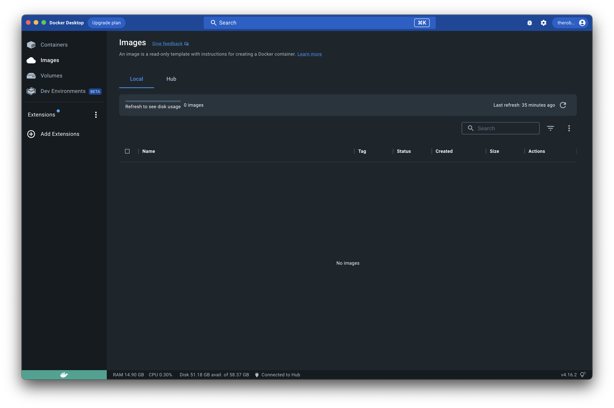

# Welcome

This project explores using [Docker](https://www.docker.com) to explore developing applications with the [R](https://www.r-project.org) and [Python](https://www.python.org) programming languages as quickly as possible using [Posit RStudio IDE](https://posit.co/products/open-source/rstudio/) or [VS Code](https://code.visualstudio.com).

## Background

The primary goal of this project was to create a containerized environment to explore [Posit RStudio IDE](https://posit.co/products/open-source/rstudio/) that would work on Apple Silicon. My original journey began exploring images from the highly regarded [Rocker Project](https://rocker-project.org) - known for various Docker Containers for the [R](https://www.r-project.org) environment.

As long as you run on architecture other than Apple Silicon, you'll find that the latest versions and tags will work fine. If you're on Apple Silicon, though...good fucking luck.

It took me hours of experimenting. Hours of banging my head against the wall. Reviewing horribly outdated "solutions" from the internet at large. I damn near reached the point of frustration - half considering biting the bullet and embarking down the path of building on top of a base Linux image and suffering through countless command-line incantations until the damn thing worked.

Despite the incompatibility with the latest `rocker/rstudio` Docker image, I had all but given up hope until I stumbled upon [Reproducible data science with R, RStudio Server, and Docker](https://www.richpauloo.com/post/docker-rstudio/) from Rich Pauloo which unlocked the key to much joy and delight for me.

**TL;DR** Documentation is terrible, but if you use `rocker/rstudio:latest-daily` you will happily be developing in [R](https://www.r-project.org) and [Python](https://www.python.org) within minutes.

You are more than welcome to embark on other paths, but I would strongly suggest you heed my advice and save yourself a LOT of pain and heartache.

I hope this generalized solution will work on other platforms. My interest is in using my 2021 14" MacBook Pro and the Apple M1 Max for development. I am eager to hear about your experiences using this project - and welcome any pull requests or contributions that will help others explore [R](https://www.r-project.org) and [Python](https://www.python.org) development on different platforms.

## Getting started

If you do not have [Docker](https://www.docker.com) installed on your development system, you can download and install the freely available [Docker Desktop](https://www.docker.com/products/docker-desktop). 

Once [Docker](https://www.docker.com) or [Docker Desktop](https://www.docker.com/products/docker-desktop) is running, you are ready to begin spinning up this project.

Highlights include:

- [Rocker Project Posit RStudio Server](https://hub.docker.com/r/rocker/rstudio) - Available at [http://localhost:8787](http://localhost:8787) for you to optionally login with the `rstudio` username and `rstudio` password - or whatever you have defined in [docker/rstudio/docker-compose.yml](docker/rstudio/docker-compose.yml)
  - [Posit RStudio Server](https://posit.co/products/open-source/rstudio-server/) - RStudio Server enables you to provide a browser-based interface to a version of [R](https://www.r-project.org) running on a remote Linux server, bringing the power and productivity of the [Posit RStudio IDE](https://posit.co/products/open-source/rstudio/) to server-based deployments of [R](https://www.r-project.org).
  - [Posit RStudio IDE](https://posit.co/products/open-source/rstudio/) - [Posit RStudio IDE](https://posit.co/products/open-source/rstudio/) is an integrated development environment (IDE) for [R](https://www.r-project.org) and [Python](https://www.python.org). It includes a console, syntax-highlighting editor that supports direct code execution, and tools for plotting, history, debugging, and workspace management. [Posit RStudio IDE](https://posit.co/products/open-source/rstudio/) is available in open-source and commercial editions and runs on the desktop (Windows, Mac, and Linux).
- [Radian](https://github.com/randy3k/radian) - _radian_ is an alternative console for the [R](https://www.r-project.org) programming language with multiline editing and rich syntax highlight. One would consider radian as a [ipython](https://github.com/ipython/ipython) clone for [R](https://www.r-project.org), though its design is more aligned to [julia](https://julialang.org).

## Installation

There are several paths available for working with this containerized solution:

- [Developing inside a Container](https://code.visualstudio.com/docs/devcontainers/containers) using [VS Code](https://code.visualstudio.com)
- Using the [Docker in Visual Studio Code](https://code.visualstudio.com/docs/containers/overview) extension to run [Docker compose](https://code.visualstudio.com/docs/containers/overview#_docker-compose) for building and running a development container
- Using the [docker compose CLI](https://docs.docker.com/compose/reference/) to manually build and manage services in [Docker](https://www.docker.com) containers

### VS Code

If you are a fan of using [VS Code](https://code.visualstudio.com), you will notice this project includes recommended extensions to be installed if they haven't already been installed by you previously.

#### Developing inside a Container

To get started, make sure you have the [Visual Studio Code Dev Containers](https://marketplace.visualstudio.com/items?itemName=ms-vscode-remote.remote-containers) extension installed.

Once you open this project in [VS Code](https://code.visualstudio.com), you may notice the following in the bottom right of your screen:

If you select `Reopen in Container`, the [Visual Studio Code Dev Containers](https://marketplace.visualstudio.com/items?itemName=ms-vscode-remote.remote-containers) extension will build a development container that will run within your [Docker](https://www.docker.com) environment as specified by [.devcontainer/devcontainer.json](.devcontainer/devcontainer.json) and [docker/rstudio/docker-compose.yml](docker/rstudio/docker-compose.yml).

When you first pull, build, and create your development container, this process will take a few minutes. Subsequent runs will use the already-built container and be much faster to load and jump into coding. 🤓

##### What's happening?

Depending on your development environment, you may already be using a variety of [Docker](https://www.docker.com) containers, images, volumes, and more. 

However, if you're starting from a clean slate, let's look at [Docker Desktop](https://www.docker.com/products/docker-desktop) for macOS. You may see a Dashboard that is similar to the following:

Let's select `Reopen in Container` for our project to build the development container we will use for this project:

Feel free to click the link to view the log as this container is built.

VS Code will reload with the Dev Container that was just created.

Note the following from the above image:

- The upper left Explorer view shows the contents of all folders and files underneath the `examples` folder from our project.
  - If you open a Terminal session within the container, you will see these files exist at the `/home/rstudio/examples/` path - and they can be updated from within the container OR from within the local folder
- The bottom left shows that we have successfully connected to our `Dev Container`
- The bottom right shows a pane running a custom [examples/scripts/setup.sh](examples/scripts/setup.sh) script that automatically executes when our container is initially built. This script can be modified to install additional libraries into our development container.

If we take a look back at [Docker Desktop](https://www.docker.com/products/docker-desktop) for macOS, we now see that we have the following in our Dashboard:

##### VS Code Terminal

While you are working within a Dev Container in VS Code, you will have a terminal with several options available:

###### R Terminal

If you choose to create a new `R Terminal` you will see the following:

This will launch an `R Interactive` console for you to run R commands:

###### bash

If you choose to create a new `Bash` terminal you will see the following:

This will launch a `bash` shell for you to explore your dev container from the command line:

Within the `bash` shell, you can also do things like:

- Launch `radian` for developing and executing R code

- Run `rstudio-server` commands

